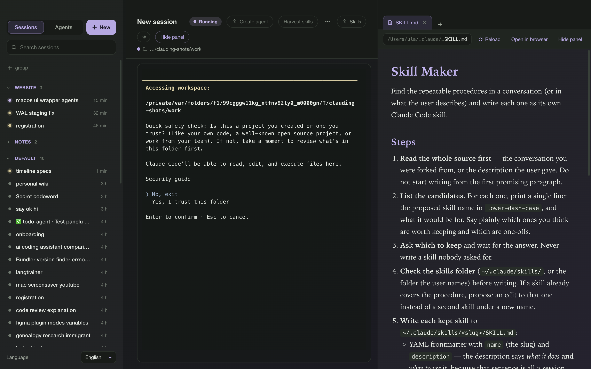
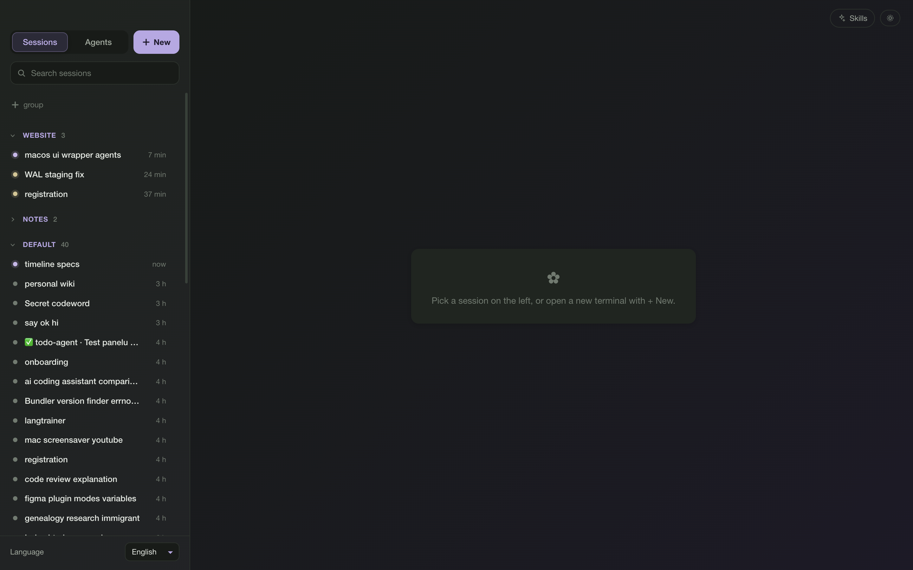

# Clauding

**A macOS desktop window around your Claude Code sessions.** Every session on
your Mac in a list on the left, a **real terminal running `claude`** in the
middle, and a **side panel with tabs** on the right — a local HTML page, a
Markdown file or a web page, next to the terminal.

It is the terminal experience, not a chat window: you type like in
Terminal.app, slash commands work, permission prompts, thinking and tool
output look exactly like the CLI draws them. Clicking a session **is** a
terminal — `claude --resume` starts in that session's folder the moment the
row is clicked.

It also runs on **Windows**, in beta: the logic is platform-aware and tested
in CI on `windows-latest`, but nobody has opened the window there yet — see
**[Windows](#windows-beta--ci-tested-logic-not-yet-hand-tested)**. Everything
else in this file describes the Mac.



## What it does

* **Your sessions, grouped your way.** Everything starts in one **Default**
  group; make more ("Website", "Work"), drag rows into them, fold a group
  shut, hide the rows you never want to see. Every session's **name** is
  written in a colour of its own — automatic, and yours from the row menu —
  while what it is doing stays the dot in front of it. A search box matches
  names, folders and first prompts.
* **Several rows at once.** ⌘-click and Shift-click pick rows out of the
  list; the menu is then about all of them — hide them, delete them, give
  them an agent, a group or a colour, in one go.
* **"Needs answer" for real sessions.** Not only a background job that
  reports itself blocked: a session that asked you something, or that is
  holding a permission prompt, says so on its row too.
* **A real terminal in the middle.** One pty per session, `claude --resume`
  on a click, `claude` in a folder you pick from "+ New". Nothing to close:
  quitting the app hangs every terminal up, and a terminal nobody typed into
  closes itself after 20 idle minutes.
* **A side panel with tabs.** Show a local `.html` or `.md` file or any
  http(s) address next to the terminal. Local files reload themselves when
  they change on disk, so a page Claude is editing updates while you watch.
  Whether the panel is open is remembered **per session**.
* **Agents.** An agent is a name, an emoji and the folder its
  definition is read from. Start a session as one and its definition goes
  into the system prompt; its emoji then marks every row it ever ran.
* **Find in conversation.** ⌘F searches the session's whole JSONL
  transcript — everything the terminal ever printed, tool results and
  thinking included — and puts the hits in the side panel.
* **Fork.** Any conversation can be copied into a *new* terminal, with the
  original left exactly as it was — including a session that is busy
  somewhere else.
* **An agent that makes agents, a skill that makes skills.** Both ship with
  the app: **Agent Maker** is the first row of the Agents tab, **skill-maker**
  is seeded into your skills folder. **Create agent** turns the conversation
  you are in into a new agent definition, **Harvest skills** turns it into
  skills, and **Skills** in the menu bar (and at the bottom of the terminal
  header's "…") lists every skill on the Mac with its description. Clicking one **reads it
  over the terminal** — the terminal keeps running underneath — and **Scan
  for skills…** looks through the rest of the Mac for skills worth copying
  into your skills folder.
* **`clauding open <path or URL>`.** A command on the PATH of every terminal
  the app opens, so the session itself can put a page in the panel. Every
  session is told about it through a preamble appended to its system prompt.
* **Four interface languages**: English, Polski, Español, 简体中文. The app
  follows the system language on first start and remembers what you pick.



## Screenshots

`docs/screenshots/` holds the two pictures above: `three-columns.png` (a
terminal in a scratch folder with a skill open in the side panel) and
`session-groups.png` (the list with two groups of its own, one folded shut).
Both are captured with the dev screenshot hook described under **Dev-only
hooks**, against a throw-away `--user-data-dir`, so the groups and agents in
them are demo state and nothing real was touched.

## Requirements

* **macOS 13** or newer. (Windows 10/11 works too, in beta — see
  **[Windows](#windows-beta--ci-tested-logic-not-yet-hand-tested)** below.)
* **Node.js 22** or newer (`node --version`).
* **Claude Code CLI**, installed and already logged in — the app never asks
  for credentials, it only starts `claude` the way your terminal does. It
  uses `~/.local/bin/claude` when that file exists, otherwise `claude` from
  your PATH (on Windows: `%USERPROFILE%\.local\bin\claude.exe`, then
  `claude.cmd` there, then whatever `where claude.exe` / `where claude.cmd`
  answers). Set **`CLAUDING_CLAUDE_BIN=/path/to/claude`** to point it at a
  different binary — a second install, a version manager, a wrapper script —
  without touching your PATH; it wins over all of them.

## Install

```
git clone https://github.com/ula-k/clauding.git
cd clauding
npm install          # also prepares node-pty for Electron
npm run install-app  # builds the renderer and puts Clauding.app in /Applications
```

`npm run install-app` writes a real macOS application bundle at
`/Applications/Clauding.app`. It is the `Electron.app` from this checkout's
`node_modules`, copied and renamed: the property list says Clauding, the
executable is called Clauding, the icon and the version number are ours, and
it is signed ad-hoc so macOS will start it. That rename is what a launcher
script could not do — macOS reads the leftmost menu-bar title and the About
panel from the bundle itself, never from `app.setName()`, so a script that
started the stock Electron.app always ended up calling the app "Electron".

The bundle still holds none of the app's code. Its whole entry is
`Contents/Resources/app/main.js`, two lines importing *this* checkout's
`electron/main.js` by absolute path, so the running app is always the project
folder and its last `npm run build` — no second copy of the source, no
`node_modules`, no asar. After changing the code, `npm run build` is enough
for the next launch.

Re-run `npm run install-app` after `git pull` (or after moving the checkout):
the Electron version, the version number and the icon inside the bundle are
the ones that were current when it was written. It costs about 290 MB in
`/Applications` — that is Electron, and the one in `node_modules` stays too.
`npm run uninstall-app` removes the bundle again, and only ever one this
script wrote.

Launch it from Launchpad, Spotlight or `open -a Clauding`.

## Updating

There is no update server: the running app *is* this checkout, so the check
is a git one. **Clauding → Check for new version…** in the menu bar (nothing
in the window: new functions go in the menu bar) runs a read-only `git fetch
origin` in the project folder, counts `HEAD..origin/main` and reads the
version out of `origin/main:package.json`. It then says either **"You're up
to date (0.2.0)"** or **"Clauding 0.3.0 is available — 7 new changes since
your version (0.2.0). Update now?"** with **Update** / **Later**.

**Update** only runs when the checkout is a clean `main`; otherwise a dialog
says so and hands over the four commands: `git pull && npm install && npm run
build && npm run install-app`. That is exactly what the app runs itself, in
that order, behind a small progress sheet naming the step. If a step fails,
its last lines are shown and nothing else is tried. On success it offers
**Relaunch now** — which closes every terminal open in the app (the
conversations are kept and can be resumed).

Once a day, at start-up, the same check runs **quietly**: it opens no dialog
and changes nothing but the menu item's text, which becomes **"Update
available (0.3.0)…"**. The decision behind all of this is one pure function,
`updatePlan()` in `electron/updater.js`, covered by `test/updater.test.js`;
the tests never fetch, pull or install.

## Windows (beta — CI-tested logic, not yet hand-tested)

**Read this first.** Clauding was written on a Mac and is used on a Mac. The
Windows support was written *without a Windows machine to try it on*: every
place that had a macOS assumption in it is now platform-aware, every Windows
branch is covered by tests that run those code paths on macOS with
`platform: "win32"` injected (`test/platform.test.js`), and the whole suite
plus a real `node-pty` pty runs on `windows-latest` in CI
(`.github/workflows/test.yml`). That is a long way from *tried*: nobody has
yet opened this window on Windows. Treat it as a beta and expect to report
things.

### Requirements

* **Windows 10 or 11**, 64-bit.
* **Node.js 22** or newer (`node --version`).
* **Claude Code for Windows**, installed and already logged in — the app
  never asks for credentials, it only starts `claude` the way your terminal
  does.
* **Git**, for the clone and for **Check for new version…**.

### Install

```
git clone https://github.com/ula-k/clauding.git
cd clauding
npm install          # also prepares node-pty (ConPTY) for Electron
npm run install-app  # builds the renderer and writes the launcher + Start Menu entry
```

`npm run install-app` writes three small things and copies nothing:

| what | where |
| --- | --- |
| `Clauding.vbs` | `%LOCALAPPDATA%\Programs\Clauding\` — the launcher; run by `wscript.exe`, so no console window flashes up |
| `Clauding.cmd` | the same from a command prompt, with the app's log left visible |
| `Clauding.ico` | the icon, generated from `build/icon/Clauding.iconset/*.png` by `scripts/lib/icoEncoder.js` (no image library, Node only) |
| `Clauding.lnk` | `%APPDATA%\Microsoft\Windows\Start Menu\Programs\` — made through PowerShell's `WScript.Shell`, pointing straight at this checkout's `node_modules\electron\dist\electron.exe` |

There is no application bundle to rename here, and nothing to sign: on
Windows the window and the task-bar entry are named by `app.setName()` in
`electron/main.js`, so the launcher can simply start Electron with the
checkout as its argument. Everything still runs the project folder and its
last `npm run build`, exactly like the macOS bundle — re-run
`npm run install-app` after `git pull` or after moving the checkout.
`npm run uninstall-app` removes the folder and the shortcut, and only ever
one this script wrote (it leaves a `clauding-install.json` behind to know).

### What is different from macOS

| | macOS | Windows |
| --- | --- | --- |
| the `clauding` channel | a Unix socket, `<userData>/clauding.sock`, chmod 0600 | a named pipe, `\\.\pipe\clauding-<hash of the user data folder>` — not a file, so nothing to unlink or chmod |
| the `clauding` command | `bin/clauding` (a `#!/usr/bin/env node` script) | `bin/clauding.cmd`, which runs `node bin\clauding`; `bin\` is still what goes in front of the terminal's PATH |
| the app's data folder | `~/Library/Application Support/Clauding` | `%APPDATA%\Clauding` |
| the pty | a posix pty | **ConPTY** (`useConpty: true`); a `claude.cmd` is a batch file and is started through `cmd.exe /c`, a `claude.exe` directly |
| the title bar | inset traffic lights, the app draws its own header | the standard Windows frame, the menu bar inside the window |
| the menu bar | Clauding / Edit / Skills / View / Window, with Services, Hide, Hide Others, Show All | the same five menus; Windows has no Services or Hide roles, so the Clauding menu is About, the version check, Settings… and Quit |
| shortcuts | ⌘⌫ hides a session, ⌘, Settings, ⌘K clears, ⌘+click opens in the system browser | Ctrl+Backspace (or Ctrl+Delete), Ctrl+`,`, Ctrl+K, Ctrl+click. **Ctrl+C stays the interrupt** in the terminal, as in every Windows console — copy with a selection and the Edit menu |
| the emoji field | a 🙂 button opens the macOS character palette (⌃⌘Space) | Electron has no call for the Windows picker, so that button is not drawn; the built-in emoji grid next to it is unchanged, and Win+. types into the field |
| PATH fix-up | `~/.local/bin`, `/opt/homebrew/bin`, `/usr/local/bin` | `%USERPROFILE%\.local\bin` only |
| "Scan for skills…" | `~/Library/Application Support/Claude` among the roots | `%APPDATA%\Claude` instead; `%USERPROFILE%\.claude\plugins` and `%USERPROFILE%\.hermes\skills` the same as ever |
| the dev hooks | the screenshot hook and every `CLAUDING_SMOKE_*` run | macOS-only by design: they photograph the window and read the macOS About panel. On Windows they print one line saying so and change nothing |
| updating | `git`, `npm`, `npm run build`, `npm run install-app` | the same four, with `npm.cmd` (a batch file needs a shell) |

### What is assumed, and has never been checked

The app reads three registries the Claude Code CLI keeps, and the port
assumes they are **identical on Windows apart from the folder separator**:
`%USERPROFILE%\.claude\sessions\<pid>.json`,
`%USERPROFILE%\.claude\jobs\<shortId>\state.json`,
`%USERPROFILE%\.claude\projects\…` and `%USERPROFILE%\.claude.json` with
its `projects` map — the same field names, the same `busy` / `idle` and
`working` / `blocked` values. If Windows Claude Code puts them anywhere else,
or spells the status differently, the session list will look empty or
colourless and **that is where to look first**. The assumption is written
down in `electron/lib/platformPaths.js`, in one place, so changing it is one
edit.

### Known unknowns

Things no test on a Mac can settle, in the order they are likely to bite:

1. **Whether the pty behaves.** node-pty attaches to ConPTY in CI, but a real
   `claude` session redrawing a full-screen TUI through ConPTY is another
   matter: the resize handshake and the alternate screen buffer are the
   classic sore spots.
2. **Session linking.** It depends on node-pty's child pid being the pid the
   CLI writes its registry entry under. Through `cmd.exe /c` it is the
   interpreter's pid, not `claude`'s — the fallback (a live registry entry in
   the same folder, started after the spawn) should cover it, but that is a
   guess. Pointing `CLAUDING_CLAUDE_BIN` at `claude.exe` avoids the wrapper
   entirely and is the first thing to try.
3. **Hanging a terminal up.** There are no signals: node-pty ends the console
   process however it can, so "closes itself after 20 idle minutes", the
   restart after "Extra claude flags…" and the hang-up on quit may all be
   blunter than on macOS.
4. **`--append-system-prompt-file` and long command lines.** Windows caps a
   command line at about 32 000 characters, so the inline fallback for an
   agent's whole definition may simply not fit.
5. **The Start Menu shortcut.** PowerShell's execution policy, or a machine
   where PowerShell is locked down, will make `install-app` say so and fall
   back to the `.vbs`.
6. **Fonts and the emoji field.** The terminal asks for `"SF Mono", Menlo,
   Monaco, monospace`; on Windows that lands on whatever the system calls
   monospace, and the agent emoji may render as a flat glyph.
7. **High-DPI scaling** at anything other than 100%.

## Run from source

```
npm start          # Vite dev server + Electron, with hot reload for the renderer
npm run build      # bundles the renderer into dist/renderer
npm run preview    # Electron loading the built renderer
npm run check      # syntax check + naming rules (no one-letter names, no jargon abbreviations)
npm run rebuild    # compiles node-pty against this Electron (only if the prebuilt binary fails)
npm test           # the test suites (see Tests below)
```


## How it works, in one page

**What it reads.** Three things kept by the Claude Code CLI, all read-only:
the transcripts under `~/.claude/projects/*` (through
`@anthropic-ai/claude-agent-sdk`: `listSessions`, `getSessionInfo`,
`renameSession`), the per-process registry `~/.claude/sessions/<pid>.json`
and the background-job registry `~/.claude/jobs/<shortId>/state.json`, which
together give the Running / Waiting colours. The app writes **one** file
under `~/.claude`, and only after you have said yes to it:
`<skillsRoot>/skill-maker/SKILL.md`, the built-in skill (see **Seeding**) —
Claude Code loads skills from that folder and nowhere else, so there is
nowhere else to put it. Everything else under `~/.claude` is written by the
`claude` processes in its terminals — their own transcripts and registry
entries, exactly as from Terminal.app.

**What it writes**, all in `~/Library/Application Support/Clauding/`:

| File | What is in it |
| --- | --- |
| `groups.json` | your groups, which session is in which, hidden and folded ones |
| `agents.json` | your agents and the session → agent links |
| `panel-tabs.json` | each session's panel tabs and whether its panel is open |
| `preamble.md` | the text appended to every session's system prompt |
| `settings.json` | where new agent definitions are written, and the skills folder |
| `clauding.sock` | the socket the `clauding` command talks to (mode 0600) |

**The preamble.** `preamble.md` starts as a copy of
`electron/preamble-default.md`: it tells the session it runs inside Clauding,
describes the panel and says to use `clauding open`. Edit it and your version
is kept for good; while it is still byte-identical to a default this app once
shipped (recognised by a SHA-256 in `electron/preamble.js`), a new version
replaces it.

**`--system-prompt-snapshot off`.** Every terminal is started with this flag.
Without it the CLI reuses the system prompt stored with the conversation, so
a resumed session would never see the preamble — and one that had not heard
of the side panel published a claude.ai Artifact instead of opening the page.
With `off` the prompt is rendered fresh on every request, so new sessions,
resumes and forks all get it.

**Why plain JavaScript?** Because this is a small app meant to stay readable
without a build step to explain it: no TypeScript, no type annotations, no
one-letter names and no jargon abbreviations — `npm run check` enforces the
last two.

The rest of this file is the detail: how each part works and why it is built
that way.

## Layout

```
electron/main.js           window, IPC handlers, registry + project watchers, dev hooks
electron/terminals.js      the terminal registry (one pty per terminal, session linking, idle auto-close)
electron/claudeCli.js      where `claude` is, PATH fix-up, the environment the pty gets, and how a .cmd is spawned
electron/lib/platformPaths.js  every path that differs between macOS and Windows, in one place
electron/lib/applicationMenu.js  the menu bar as a value, and what Windows leaves out
electron/panelTabs.js      the right panel's tabs and per-session visibility + panel-tabs.json
electron/commandSocket.js  the Unix socket (named pipe on Windows) the `clauding` command talks to
electron/preamble.js       the system-prompt preamble (preamble.md)
electron/preamble-default.md   the default preamble text itself
electron/fileWatch.js      fs.watch helper for auto-reloading local pages
bin/clauding               the `clauding` command put on every terminal's PATH
bin/clauding.cmd           the same command on Windows (runs `node bin\clauding`)
electron/smokeFolder.js    where the dev smoke runs work (and what the list hides)
electron/smokeTerminal.js  CLAUDING_SMOKE_TERMINAL automation (dev only)
electron/smokeFork.js      CLAUDING_SMOKE_FORK automation for the Fork button (dev only)
electron/smokeKickoff.js   CLAUDING_SMOKE_KICKOFF: the two meta actions start on their own (dev only)
electron/smokePreamble.js  CLAUDING_SMOKE_PREAMBLE: the preamble on a resumed session (dev only)
electron/smokeResize.js    CLAUDING_SMOKE_RESIZE: the two drag handles (dev only)
electron/recentProjects.js recent project folders from ~/.claude.json for "+ New"
electron/preload.cjs       contextBridge -> window.clauding
electron/channels.cjs      IPC channel names (shared by main + preload)
electron/sessions.js       listSessions() + enrichment (title, folder label, colour, status, ownership), and finding + reading a session's transcript files for the search
electron/lib/transcriptSearch.js  parsing and searching a transcript JSONL (pure: no Electron, no fs)
electron/lib/needsAnswer.js       whether the end of a transcript is a session waiting for an answer (pure)
electron/sessionGroups.js  the user's own groups + hidden sessions (groups.json)
electron/agents.js         the user's agents + session -> agent links (agents.json)
electron/settings.js       settings.json: the agents root and the skills folder
electron/skills.js         reads <skillsRoot>/*/SKILL.md (name + description)
electron/builtins.js       seeding the built-in Agent Maker and the built-in skills
electron/lib/terminalKickoff.js  when a fork may be typed into, and what counts as typing
electron/lib/extraFlags.js  the extra `claude` flags: splitting the field, the reserved ones, the merge
electron/sessionFlags.js   session-flags.json: the flags one conversation keeps for good
electron/updater.js        "Check for new version…": the git check, the plan and the four update commands
electron/updateSheet.js    the little progress window the update runs behind
builtin/agents/agent-maker/agent-maker.md   the Agent Maker's own definition
builtin/skills/skill-maker/SKILL.md         the skill-maker skill, as shipped
builtin/skills/clauding-agents/SKILL.md     the `clauding` command, as a skill
electron/smokeAgents.js    CLAUDING_SMOKE_AGENTS automation for the agents (dev only)
electron/smokeAssign.js    CLAUDING_SMOKE_ASSIGN: "Assign to agent" end to end (dev only)
electron/smokeAgentStart.js  CLAUDING_SMOKE_AGENT_START: a new session started as an agent introduces itself (dev only)
electron/smokeFlags.js     CLAUDING_SMOKE_FLAGS: the extra flags on the composed command line (dev only, dry)
electron/smokeEmoji.js     CLAUDING_SMOKE_EMOJI: the agent form's emoji field (dev only)
electron/smokeGroups.js    CLAUDING_SMOKE_GROUPS automation for the list (dev only)
electron/smokeCollapse.js  CLAUDING_SMOKE_COLLAPSE automation for folding a group shut (dev only)
electron/liveStatus.js     Running / Waiting derived from ~/.claude registries
electron/projects.js       folder labels ("…/projects/website"), colour index, ~ paths
scripts/prepareNodePty.js  postinstall: makes node-pty usable inside Electron
scripts/checkNodePty.js    CI: a real pty, no Electron — the one thing a Mac cannot answer for Windows
scripts/start.js           npm start (Vite dev server, then Electron)
scripts/check.js           npm run check
scripts/installApp.js      npm run install-app: the /Applications bundle
scripts/lib/appBundle.js   what goes inside Clauding.app (renamed Electron.app)
scripts/lib/windowsLauncher.js  the Windows install, as a plan: launcher, icon, Start Menu shortcut
scripts/lib/icoEncoder.js  PNG frames -> Clauding.ico, with no dependency
scripts/uninstallApp.js    npm run uninstall-app
src/renderer/              React 18 + Vite (JSX), styles/theme.css holds every colour
src/renderer/platform.js   the modifier key, the shortcut labels and whether there is an emoji panel
src/renderer/terminalInstances.js  the xterm.js instances, kept alive outside React
src/renderer/terminalKeys.js  what Cmd / Ctrl plus a letter means, and which printed paths are links
src/renderer/components/TerminalPane.jsx   the visible terminal (fit + focus)
src/renderer/components/MiddleColumn.jsx   header + terminal, or the short note for a session running elsewhere
src/renderer/toolbarFit.js         which header controls stay on the one line and which fall into the "…"
src/renderer/components/SidePanel.jsx      the right panel: tab strip, toolbar, webview / markdown tabs
src/renderer/components/SessionsColumn.jsx the left column: groups, rows, "+ group", "Hidden (N)"
src/renderer/components/GroupHeader.jsx    one group header: name, count, "+", "…" menu, drop target
src/renderer/components/SessionRow.jsx     one row: status dot, name, right-aligned time, "…" menu
src/renderer/components/PopupMenu.jsx      the "…" menus (fixed position, closes on Escape / outside click)
src/renderer/components/AgentsTab.jsx      the left column's second tab: one row per agent
src/renderer/components/AgentForm.jsx      add / edit an agent (name, emoji, definition folder + file)
src/renderer/components/EmojiPicker.jsx    the built-in emoji list under the form's emoji field
src/renderer/emojiChoices.js       the first-grapheme rule + the 64 curated emoji and their keywords
src/renderer/components/AgentBadge.jsx     the agent's emoji in its neutral circle (rows) and the header chip
src/renderer/components/AssignAgentDialog.jsx  the "Assign to agent" question, asked before anything is written
src/renderer/assignmentPlan.js     what each of that dialog's buttons means (write the link? restart?)
src/renderer/components/DeleteSessionDialog.jsx  the one destructive confirmation: delete a session
src/renderer/components/AgentPickerSheet.jsx     "More…": every agent, with a search box
src/renderer/components/WindowTools.jsx    the settings gear (top-right) and the Skills + settings popovers
src/renderer/components/DocumentReader.jsx a skill / an agent definition read over the terminal
src/renderer/components/FindBar.jsx        "Find in conversation…": the bar over the terminal
src/renderer/components/SearchResults.jsx  its hits, in the side panel's Search tab
src/renderer/components/SkillsScanSheet.jsx  "Scan for skills…": candidates found on the Mac
src/renderer/components/BuiltinSkillSheet.jsx  the first-run question about the built-in skill
electron/skillsScan.js     where skills hide on a Mac, and copying one into the skills folder
src/renderer/metaPrompts.js        the task lines the two meta actions put in the prompt file
src/renderer/agentConstants.js     the small label helpers of the agent rows and menus
src/renderer/sessionColors.js      a session's colour: the eight palette tokens, the stored one and the automatic one
src/renderer/selectionPlan.js      what a click on a row means (⌘, Shift, plain) and what a bulk action would do
src/renderer/components/ColorMenu.jsx      the "Colour ▸" submenu: "Automatic" and the eight swatches
src/renderer/sessionGrouping.js    sessions + groups.json -> what the column draws
src/renderer/groupConstants.js     the "default" group id and its translated label
src/renderer/i18n.js               translate(), the language list and the system-language mapping
src/renderer/locales/      en.json, pl.json, es.json, zh-CN.json — every UI string goes through translate()
.github/workflows/test.yml the CI run: macOS and Windows, check + tests + build (+ a real pty on Windows)
```

The SDK (`@anthropic-ai/claude-agent-sdk`) is only used for reading:
`listSessions` and `getSessionInfo` — and `renameSession` for the editable
title. (`getSessionMessages` went with the read-only preview; the one thing
that reads a transcript now is **Find in conversation**, which reads the
`.jsonl` file itself.) The only thing the app itself writes under
`~/.claude` is the built-in skill, once you have agreed to it (see
**Seeding**); the `claude` processes in the terminals write their own
transcripts and registry entries, like they do from Terminal.app.

Electron runs as ESM (`"type": "module"`); the preload script is CommonJS
(`electron/preload.cjs`) because Electron loads preload files through its own
loader, and it requires `electron/channels.cjs`, the single list of IPC
channel names.

## Terminal architecture

### The pty (main process, `electron/terminals.js`)

`node-pty` spawns `claude --append-system-prompt <preamble>
--system-prompt-snapshot off` (plus `--resume <sessionId>` for an existing
session, and `--fork-session --name "<title> (fork)"` on top of that for a
fork — see **Fork** below) with:

| | |
| --- | --- |
| `cwd` | the folder picked in "+ New", or the session's own cwd |
| `env` | `process.env` minus the `CLAUDECODE` / `CLAUDE_CODE_*` markers, plus `TERM=xterm-256color`, `COLORTERM=truecolor`, `TERM_PROGRAM=Clauding`, `CLAUDING_TERMINAL_ID=<terminal id>` and `<project>/bin` prepended to `PATH` (for the `clauding` command); `LANG` inherited |
| size | the last known xterm size (the pane sends the exact one right after it mounts) |

The preamble is read from `~/Library/Application Support/Clauding/preamble.md`
at every spawn (the file is created with the default text — `electron/preamble-default.md` —
on first use, edit it freely). `--append-system-prompt` is accepted in
interactive mode by CLI 2.1.271 — verified by asking the session what app it
runs inside.

**A terminal running as an agent** gets **one** append instead, holding the
preamble, a line saying who it is, and the agent's whole definition file (see
**Agents**). That is far too much text for a command line argument, so it is
written to `<userData>/prompts/<terminalId>.md` and passed with
`--append-system-prompt-file`, and the file is deleted when the pty exits
(anything left behind by a pty killed on quit is cleared at the next start).
`--append-system-prompt-file` has **no option line of its own** in
`claude --help` — it is only mentioned inside the `--bare` paragraph as
`--append-system-prompt[-file]` — so `claudeCli.js` probes for it once instead
of reading the help: the flag is put in front of the `mcp` subcommand, which
prints its usage and exits at once, and an option the CLI does not know makes
it say "unknown option" first. It exists in CLI 2.1.272 and is what this Mac
uses; without it the same text is passed inline with `--append-system-prompt`.

**Why `--system-prompt-snapshot off`.** By default (`on`) the CLI renders the
system prompt once, on a conversation's **first** request, records it, and
replays that recording on every later request *and every resume* — so a
session that was not born inside Clauding never sees our preamble, however
often it is resumed here. That is exactly what went wrong once: a resumed
session asked to "open it in the panel on the right" published a claude.ai
Artifact, because nothing had ever told it about the side panel or about
`clauding open`. With `off` the prompt is rendered fresh on every request, so
the preamble reaches new sessions, resumes and forks alike. The flag is
documented in `claude --help` (CLI 2.1.272).

**Keeping the stored preamble fresh.** At startup `refreshStoredPreamble()`
compares `preamble.md` with every default this app has ever written. If it is
still byte-identical to one of them it is replaced with the current default
(otherwise sessions would keep an old text forever); if you edited it, it is
left exactly as it is and a line goes into the log saying so.

**Nothing closes a terminal by hand.** There is no "Close terminal" button —
nobody wants to close one. Two things still hang ptys up, both automatic:

* **On quit** `closeAll()` sends SIGHUP to every pty, so no `claude` outlives
  the window (`before-quit` in `electron/main.js`).
* **Idle auto-close.** A terminal that a *click* on the session list opened,
  that never received a keystroke and whose CLI has then sat idle for 20
  minutes is hung up (SIGHUP; the session stays on disk and can be clicked
  again), so browsing the list cannot pile up `claude` processes. Terminals
  from "+ New", and any terminal you typed into, are never touched.

The `CLAUDE_CODE_*` variables are stripped because a Clauding started from
inside a Claude session would otherwise pass them on, and the CLI then treats
itself as a nested child: "Transcript saving is off" and no registry entry
(seen while testing). `process.env.PATH` gets `~/.local/bin`,
`/opt/homebrew/bin` and `/usr/local/bin` prepended at startup because a
Dock-launched app has a minimal PATH.

The registry keeps one record per terminal id: pid, cwd, session id, the
CLI's `busy`/`idle` status, and a bounded replay buffer (400 kB) so a reloaded
renderer can rebuild its xterm from what was printed. Output chunks are joined
and shipped once per ~16 ms (`terminal:data`); input (`terminal:input`) and
resizes (`terminal:resize`) are fire-and-forget messages. The internal
`close()` sends SIGHUP and SIGKILL after 3 s if needed; the transcript stays
on disk.

IPC: `terminal:open`, `terminal:input`, `terminal:resize`, `terminal:list`,
`terminal:replay` (renderer → main) and `terminal:data`, `terminal:exit`,
`terminal:changed` (main → renderer).

### Session linking

Verified with CLI 2.1.270/271: the CLI writes `~/.claude/sessions/<pid>.json`
right after start (`kind: "interactive"`, `entrypoint: "cli"`, `status`
`busy`/`idle`), and node-pty's child pid **is** that pid (the binary does not
re-exec). The registry reads the file named after each terminal's pid — on
every registry change plus a 1 s poll while a terminal is alive — and links
the session id the moment it appears. Fallback after 10 s without a pid file:
a live registry entry with the same cwd that started after the spawn. For
`--resume` the session id is known up front and confirmed the same way (the
CLI keeps the id).

Ownership feeds the session list: `listSessions` rows whose session belongs
to a live terminal get `ownedByApp: true` and `liveStatus.source = "app"`
(the running / waiting-for-you status itself still comes from the CLI's own
registry entry — the same source Terminal.app sessions use). Until the transcript
file exists (written at the first prompt) the renderer shows a placeholder
row built from the terminal record.

### The renderer

`terminalInstances.js` owns the xterm.js objects (`@xterm/xterm` 6 with the
fit and web-links addons), keyed by terminal id and kept for the life of the
app. `TerminalPane` only moves a terminal's wrapper element into the visible
pane and back out, so switching sessions keeps scrollback, cursor and
selection, and terminals that are off screen keep receiving output. xterm is
opened lazily the first time its pane is on screen (opening it in a detached
element measures nothing); output that arrives before that is buffered.

Look: colours are read from `theme.css` tokens (`--terminal-*` for the ANSI
palette, `--text`, `--accent` for the lavender block cursor), font
`"SF Mono", Menlo, monospace` 13 px, 12 px padding, 10 000 lines of
scrollback, translucent surface over the window gradient. Cmd+C / Cmd+V go
through Electron's default Edit menu, which turns them into copy / paste
events on xterm's hidden textarea (selection out, clipboard text in); Cmd+K
clears. Ctrl+C is the interrupt, as in any terminal. Option is left alone so
Polish letters type normally.

What the middle column shows for the selected session:

| state | shown |
| --- | --- |
| a live terminal of this app owns it | that terminal |
| a terminal / job outside the app owns it | a short centred note: title, folder, "This session is running in another terminal or job. Finish it there, then click it here to continue." — and a **Fork** button |
| nobody runs it | a terminal, immediately: the click spawns `claude --resume` in its cwd |

A third, barely visible state ("Opening a terminal…") is on screen for the
few milliseconds before the click's terminal exists, and stays if spawning it
failed — a missing folder, for example, which also raises an alert.

**Clickable links.** URLs in the terminal (`@xterm/addon-web-links`) and
absolute or `~/` paths ending in `.html`, `.htm`, `.md` (a custom xterm link
provider that also handles paths wrapped over several rows) open in the right
panel of that terminal's session on click; Cmd+click hands them to the
system instead (Chrome for URLs, the default app for files).

### node-pty inside Electron

node-pty 1.1.0 ships prebuilt N-API binaries (`prebuilds/darwin-arm64/`), so
it loads in Electron 44 without compiling — but its tarball stores
`spawn-helper` without the execute bit and npm 11 no longer runs the package's
own install scripts, so every spawn failed with `posix_spawnp failed` until
the bit was set. `scripts/prepareNodePty.js` (the `postinstall`) sets it and
then requires node-pty inside Electron (`ELECTRON_RUN_AS_NODE=1`) to prove the
binary matches; if that fails it runs `electron-rebuild --only node-pty`
automatically. `npm run rebuild` forces that compile (needs the Xcode command
line tools; takes about a minute). Both paths were verified on this Mac.

## The terminal header: one line

The header is **one line, never two**. Left to right: the **title** (click to
rename, truncates with an ellipsis, never narrower than 160 px), then the
controls, then the **"…"**, the **settings gear** and **Hide / Show panel**.
Under it sits a second, purely informational line: the project folder (its
tooltip names the flags this terminal really started with) and the git
branch. That line is not a toolbar and nothing ever moves out of it.

What does not fit goes into the "…", and **nothing is ever in both places**.
The rule is measured, not guessed (`src/renderer/toolbarFit.js`, dry-tested
in `test/toolbarFit.test.js`):

* every control is drawn once and read back inside a layout effect, so the
  measuring pass is over before the window is painted; the widths are kept
  and only re-taken when the controls or the language change;
* a `ResizeObserver` on the row supplies the width it has to fit in;
* `fitToolbar()` keeps controls **from the highest priority down** for as
  long as they fit — where a control is drawn has nothing to do with whether
  it is kept — and the first one refused stops the line, so a small
  unimportant control never jumps in over a big important one.

The order, most important first: **Hide / Show panel**, the **settings
gear** (neither is ever hidden — they are the corner the eye goes to), the
**agent chip**, the **status pill**, **Fork**, **Create agent**, **Harvest
skills**. **Skills** has no button at all any more: it is at the bottom of
the "…" and in the macOS **Skills** menu.

The "…" holds, in this order:

1. whatever overflowed, most important first — a button as a menu item, and
   the agent chip or the status pill **as themselves**, because they were
   never buttons and a menu row that cannot be clicked would be a lie;
2. a separator;
3. the session actions that were never buttons: **Extra claude flags…**,
   **Assign to agent ▸**, **Delete session…**, **Skills**, **Rename
   session**.

Because that second group is always there, the "…" is always on the header —
it is the only way to those five.

## Fork

Claude Code can fork a conversation, but a fork in one window would replace
what is on screen. Here it opens a **second terminal**: the copy takes over
the middle column, **the original keeps running, untouched**, and both rows
sit in the list.

A **Fork** button lives in the terminal header, right of the status pill
(or, on a narrow window, in the header's "…" — see **The terminal header:
one line**)
(tooltip: *"Start a copy of this conversation in a new terminal; this one
stays as it is."*). It appears as soon as the terminal has a session id. The
same button is on the note for a session running in a terminal or job
**outside** the app — forking is the one useful thing that can be done with
such a session, so that note is not a dead end any more.

The click spawns a new pty in the **original session's own folder** (the
fork's transcript lands under the cwd the command starts in, so this matters):

```
claude --resume <sessionId> --fork-session --name "<original title> (fork)" --append-system-prompt <preamble> --system-prompt-snapshot off
```

plus the same environment every Clauding terminal gets (`CLAUDING_TERMINAL_ID`,
`bin/` on `PATH`, the `CLAUDE_CODE_*` markers stripped).

* `--fork-session` gives the copy a **new session id**; the original
  transcript file is not modified.
* `--name` sets the CLI's display name, so the new row reads
  `<original title> (fork)` straight away — the suffix is deliberately not
  translated, because it is stored in the session, not redrawn by the app.
* The terminal record therefore starts with **no** session id (it must not
  claim the original's) and waits for the CLI to register the new one, the
  same linking path every terminal uses.
* **Group rule.** The moment the fork's session id is known it is put into
  the **same group as the original** (`assignSession`, the same mechanism a
  group header's `+` uses). Nothing else is copied: not the panel tabs, not
  the hidden flag.

**Forking a session that is busy.** Allowed, and no different: the fork gets
whatever is on disk at that moment. Verified on CLI 2.1.272 by making a
scratch session count slowly and pressing Fork mid-count: **the CLI printed no
warning and asked nothing** — the fork started at its prompt with the whole
conversation including the pending question ("Count out loud from 1 to 40…")
but, of course, without the answer the original was still writing. The
original kept counting in its own terminal. So there is nothing to pre-answer
and no prompt to pass through; the only thing to know is that a fork taken
mid-turn stops one message short.

## The right panel (`SidePanel.jsx`, `electron/panelTabs.js`)

Hidden by default; "Show panel" / "Hide panel" in the middle column's header,
`clauding panel show|hide` from a session, and a drag handle on its left edge
for the width.

**Open or closed is per session, the width is not.** Whether the panel is up
is stored as `panelVisible` next to that session's tabs in `panel-tabs.json`,
so one session can sit next to a page while the next one shows only its
terminal, and switching between them puts each panel back the way it was —
across restarts too. The rules:

* a session with no flag of its own **follows its tabs**: visible when it has
  some, hidden when it has none;
* "Show panel" / "Hide panel" and `clauding panel show|hide` write the flag
  for **that one session** — the command for the session it was run from,
  never for the window;
* `clauding open` (and the address field) sets it to visible for the session
  the tab belongs to, which is what makes a page appear as it is opened;
* with no session selected at all the button still works, it just has nowhere
  to write the flag, so that state is not remembered.

The **width** is one setting for the whole window (`localStorage`), because a
column that changed size on every click would be unusable.

**Dragging a handle** (both the left one and the panel's) uses pointer
events, not mouse events: the handle takes `setPointerCapture`, the window
listens for `pointermove` / `pointerup`, and for the length of the drag a
transparent `.drag-overlay` (fixed, `inset: 0`, above everything) covers the
window while the panel's `<webview>` stops taking pointer events. Without
that, the pointer crossing into the page — which is what narrowing the panel
does — hands the events to the guest process and the drag stops halfway.
Widths are clamped so the terminal keeps at least 480 px: the panel between
280 px and `window width − left column − 480 px`, the left column between
240 px and 480 px in the same way. The clamp also runs **on load and on
window resize**, because a width stored while the window was bigger used to
push the handle off screen, and then the panel could not be moved at all.

A **tab strip** at the top, one tab per page: a local **HTML** file
(`file://`), a local **Markdown** file, an **http(s) URL**, or the one
**Search** tab of "Find in conversation…" (see below); the "+" tab is
an address field (paste a path or URL, Enter opens it; relative paths resolve
against the session's folder there, against the caller's cwd from `clauding open`).
Tab header: icon by type, short title (file name for files, the document
`<title>` for web pages once it arrives), close ×. Toolbar under the strip:
the address (click copies it), **Reload**, **Open in Chrome**
(`shell.openExternal` for URLs, `shell.openPath` for files), **Hide panel**.

Tabs are **per session**: switching sessions swaps the tab set, and the sets
live in `~/Library/Application Support/Clauding/panel-tabs.json` keyed by
session id, so a session's tabs come back after an app restart (and after the
terminal was closed and the session resumed later). A terminal whose CLI has
not registered its session yet keeps its tabs under `terminal:<id>` and they
move to the session id the moment it is known.

**Rendering.** HTML files and URLs render in an Electron `<webview>` (rather
than a `WebContentsView`: the webview lives in the renderer's DOM, so the tab
strip, the resizable width and per-session mounting are plain React/CSS; a
`WebContentsView` would have to be positioned from the main process on every
layout change). Every webview is locked down in `will-attach-webview`: no
preload, `nodeIntegration` off, `contextIsolation` and `sandbox` on, its own
`persist:clauding-panel` partition, only `file:`, `http:` and `https:` sources,
and `window.open` from inside a page goes to the system browser. Markdown
renders through the `marked` + `highlight.js` pipeline of `markdown.js`, in a
scrollable reading view: serif ("Iowan Old Style", Palatino,
Georgia) 17 px, line-height 1.7, max-width 46 rem centred, dark palette.

**Auto-reload.** Local files open in a tab are watched (`fs.watch` on the
parent folder filtered by file name, so editors that save through a rename
still count; debounced 300 ms) and the tab reloads — Claude edits the page,
you see it.

Electron 44 quirk: removing a `<webview>` from the DOM (closing a tab,
switching sessions) throws a harmless "Invalid guestInstanceId" from the
element's own `disconnectedCallback` (the guest is already gone by then);
`main.jsx` swallows that one message.

## Find in conversation

> "The terminal shows what it shows, but there is always the JSON file with
> everything 1:1."

That file is the transcript the Claude Code CLI writes at
`~/.claude/projects/<project folder>/<sessionId>.jsonl` — every message, every
thinking block, every tool call and every tool result, whatever has since
scrolled out of the terminal. **⌘F** (Ctrl+F on Windows), or **View → Find in
conversation…**, searches it.

There is **no button**: the entry points are the shortcut and the menu bar,
and ⌘F *is* that menu item's accelerator, so there is no key handler of the
app's own for xterm to fight over.

**The bar.** A slim bar slides over the top of the terminal — not a second
header line; the header is one line and stays one line. The terminal keeps
running underneath. In it: the field, **"3 of 9"**, **↑** and **↓**, and a
close ×. Matching is plain text and case-insensitive (no whole-word toggle,
no patterns: a stray `(` is a bracket, not a syntax error). **Enter** searches
when the word has changed and steps to the next hit when it has not,
**Shift+Enter** steps back, **Escape** closes the bar. Selecting another
session closes it too — a different session is a different transcript.

**What is searched** (`electron/lib/transcriptSearch.js`, pure, no Electron):
the file is read line by line and only the conversation is kept —

| line | what is taken |
| --- | --- |
| `type: "user"` | what was typed (string content), and each `tool_result` block (a plain string or a list of text blocks) |
| `type: "assistant"` | each `text` block, each `thinking` block, and each `tool_use` as its name plus its input as JSON |
| everything else | skipped: `system`, `file-history-snapshot`, `file-history-delta`, `attachment`, `queue-operation`, `agent-name`, `ai-title`, `mode`, `permission-mode`, `last-prompt`, `cost-state` — bookkeeping the CLI keeps for itself, not conversation |

An `isMeta` line is skipped as well, and so is a half-written last line: the
session may be writing to the file at that very moment.

**Subagents too.** A session that sent work out has one transcript per
subagent at `<sessionId>/subagents/agent-*.jsonl`, with an
`agent-*.meta.json` beside it. Those are searched after the main file and
their hits are labelled **`subagent (Explore)`** — the `agentType` out of the
meta file — so it is clear the words were not said in the conversation
itself.

**The results** go in the side panel as that session's one **Search: <query>**
tab (`SearchResults.jsx`) — one per session, replaced by the next query, and
the panel is put up for that session, because a result nobody can see is no
result. It is drawn in the app's reading style: a header with the query and
**"9 messages, 12 matches"**, then the hits in transcript order, each one a
role badge (*you* / *Claude* / *tool result* / *subagent (…)*), what kind of
block it was, the time, and a three-line snippet — ±120 characters around the
first match, with **every** match in the window on a lavender ground
(`--accent-soft`). Clicking a hit opens the whole message under it: an
assistant's own words as markdown, everything else exactly as it is with the
matches marked. A message longer than 20 kB is cut there and says so.

**Live.** The transcript grows while the session runs, so nothing is cached
and nothing is watched: pressing Enter reads the file again, and so does the
**Refresh** link in the results header. That link is inside the panel — the
toolbar gets no new button.

**Search tabs are not saved.** `panel-tabs.json` keeps pages, not searches: a
search is a view of the transcript right now, so it is filtered out on the
way to disk and a restart comes back to the pages, not to somebody's old
query.

IPC: `transcript:search` (renderer → main, read-only) and
`transcript:find-show` (main → renderer, the menu item asking for the bar);
`panel:open-search` puts the results tab in place.

## The `clauding` command and the preamble

`bin/clauding` (`#!/usr/bin/env node`) is on the PATH of every terminal the
app opens:

```
clauding open <path or URL>     open a tab in the right panel (relative paths: against the caller's cwd)
clauding panel show|hide        show or hide the panel
clauding tabs                   list this session's tabs ("*" marks the active one)
clauding agent add <folder>     register an agent definition in the app
                                [--name "…"] [--emoji "…"]
clauding agent list             the agents registered in the app
```

`clauding agent add` is how a session that has just written a definition gets
it into the Agents tab without the user going through the form: the folder is
read exactly as the form reads it (definition file `<folder>/<folder>.md`,
else `README.md`, else the only `.md` there; the name from the `# Agent: …`
heading, the emoji from the file). The two flags override those
suggestions. A folder that is already registered is refused
and the refusal names the agent it belongs to, so a repeated call cannot
produce a second copy. It prints `Added agent "<name>" to Clauding.`, or
`clauding: could not add agent — <reason>`.

It sends one JSON line to the app's Unix domain socket at
`~/Library/Application Support/Clauding/clauding.sock` (`net.createServer` in
the main process, socket file chmod 0600 so only the same user can connect;
newline-delimited JSON both ways: `{command, target, terminalId, cwd}` in,
`{ok: true, message}` or `{ok: false, error}` out), prints the one-line
answer and exits 0 — or exits 1 when it cannot be done.
`CLAUDING_TERMINAL_ID` from the pty environment tells the app which session's
tab set the command targets.

**Which session a command lands in.** The caller's own terminal first. But
the variable is not always there — a plain shell, a subagent, a terminal the
app has forgotten — so the app then falls back, in this order, to:

1. the **session on screen** (the renderer reports the selected pane to the
   main process on every change: channel `panel:selection`);
2. the **terminal that was focused or typed into most recently**;
3. nothing — only then does the command fail, with "This terminal is not
   known to the app (CLAUDING_TERMINAL_ID missing or stale)."

The confirmation line says which one was used, so an agent cannot guess
wrong: `Opened /path/page.html in the Clauding panel.` from its own terminal,
`Opened /path/page.html in the Clauding panel (current session).` or
`(most recent terminal)` from a fallback. Every failure has one shape:
`clauding: could not open — <reason>` (and `could not change the panel` /
`could not list the tabs` / `could not add agent` / `could not list the
agents`), on stderr, exit code 1.

The default preamble (`preamble.md`, from `electron/preamble-default.md`)
tells the session it runs inside Clauding, describes the panel, and says to
use `clauding open` whenever the user asks for something "on the right" /
"po prawej" / "a la derecha" or after creating an HTML / Markdown page for
the user to look at. It also says, in as many words, that a **claude.ai
Artifact is not the side panel** and that `ctrl+]` is not the answer either —
both mistakes a session actually made.

## The session list: your groups, a colour, and hiding

The left column has two tabs: **Sessions** (everything below) and **Agents**
(see the section above).

The left column looks like the Claude Code agents view: **one line per
session, the name and nothing else**, a small status dot on the left and a
dim relative time on the right. The folder is in the tooltip, not on a second
line. The search box still matches the folder and the first prompt under the
hood, so typing "blueprint" finds a session in that folder.

**A row says two things at once, in two places.** The **name** is written
in the session's own colour (see **Session colours** below); the **dot** in
front of it says what that session is doing right now. Neither borrows the
other's colour, so a teal session is teal whether it is busy, waiting or
quiet.

**Status is a colour, not a group.** Three tokens in `theme.css` decide the
dot and nothing else does — change them there and the whole list follows:

| token | meaning | today |
| --- | --- | --- |
| `--status-working` | the CLI is busy | light lavender (`--secondary`) |
| `--status-waiting` | waiting for you / needs an answer | dusty gold (`--gold`) |
| `--status-idle` | not running | `--text-faint` |

A **working** session's dot also breathes — the one piece of movement in
the window, and it holds still for anybody who has asked the system for
less motion.

The only words on a row besides the name are the small **needs answer**
badge (see **When does a session say NEEDS ANSWER** below).

### Session colours

**Every session's name is written in a colour of its own.** That is the
whole of it: no bar, no chip, no tinted row — the list is read by colour
because the names are coloured, and a quiet session's name is the same
colour, faded.

* **It has one from the start.** Nobody has to pick anything: the colour is
  worked out from the session id (a plain hash over the eight palette
  tokens, `src/renderer/sessionColors.js`), so it is the same colour on
  every start and nothing is written to disk for it.
* **Change it** in the row's `…` menu (or its right-click) under
  **Colour ▸**: the eight swatches, and **Automatic** to give the session
  its own colour back. With several rows picked out, the same item in the
  bulk menu colours all of them at once.
* **Where it is kept**: `colors` in groups.json, session id → palette token
  — only the choices made by hand. Anything else in there (a hex value, a
  token that is not in the palette) is dropped when the file is read, and a
  deleted session takes its colour with it.
* **What it never touches**: the selection. A picked row keeps the same
  lavender background it always had, with its coloured name on top. The
  colours are the `--project-color-0` … `-7` tokens of `theme.css` — the
  same palette the project dots use.

### When does a session say NEEDS ANSWER

A background job can say it is blocked, and always could. An ordinary
session cannot: the CLI's registry entry only ever says `busy` or `idle`,
so a session that has just asked a question looked exactly like one that
finished an hour ago. The only thing that knows is the conversation itself,
so for every session that is **alive in the registry and not busy** the app
reads the **tail** of its transcript — the last 64 kB of
`~/.claude/projects/<folder>/<sessionId>.jsonl`, never the whole file — and
looks at the last thing the assistant said. It earns the badge when:

1. the last content block is a **`tool_use` with no `tool_result` after
   it** — the CLI is holding a permission prompt;
2. the message has a line starting with **`needs input:`**, or says "needs
   input" in its last 300 characters;
3. its **last non-empty line ends with a question mark**;
4. it contains one of a **short list of explicit asks** — "waiting for
   your…", "say the word", "czekam na Twoją decyzję / odpowiedź", "daj
   znać, czy", "powiedz, czy" (the whole list is one constant in
   `electron/lib/needsAnswer.js`).

A **busy** session never earns it, whatever it last said: it is still
writing. The rules are a pure function, the answer is kept per session
under the transcript's size and modification time, and it is worked out
again whenever the live status is polled or the sessions change. The badge
itself is the one the jobs have always had, so the folded group header and
the rows under an agent light up from the same flag.

### Selecting several sessions

The list works like any other list, and the selection is worked out by one
pure function (`selectionPlan()` in `src/renderer/selectionPlan.js`):

* a **plain click** picks one row and opens its terminal, exactly as it
  always did;
* **⌘-click** adds a row to the selection or takes it out again;
* **Shift-click** takes the range from the last row clicked, in the order
  the rows are drawn — across groups, but never into a group that is folded
  shut, because those rows are not on screen;
* **a modifier click never opens a terminal.** Five picked rows would
  otherwise be five `claude` processes.
* **⌘A**, while the list has the keyboard, picks out every row on screen;
  **Escape** puts the selection away (an open menu or dialog answers Escape
  first).

The rows that are picked out are tinted, and the count shows **in the search
box** as its placeholder ("3 selected") — there is no new button anywhere.

With **two or more** rows picked out, the `…` of any of them (and the
right-click) opens the **bulk menu** instead of the row's own:

| item | what it does |
| --- | --- |
| **Hide N sessions** | the same Hide as on one row, for each: the session's terminal is hung up first and the row goes under **Hidden (N)** |
| **Delete N sessions…** | one confirmation, naming the count and the first five titles. Sessions running in a terminal outside the app are **not** deleted — they are named in the question as left alone, because they are not ours to end |
| **Assign to agent ▸** | the ten most used agents and **More…**; the link is written for every picked session and no terminal is restarted (the "Assign only" half of the single question) |
| **Move to group ▸** | every group |

**⌘⌫ with a selection** follows the same "once stops, twice deletes" rule as
on a single row: rows that are on screen are hidden, and a selection whose
rows are *all* already under **Hidden (N)** is asked about and then deleted.

### Groups (`electron/sessionGroups.js`, `~/Library/Application Support/Clauding/groups.json`)

The grouping is the user's, never derived from anything:

```json
{
  "version": 1,
  "groups": [
    { "id": "default", "name": null, "order": 0 },
    { "id": "<uuid>", "name": "Website", "order": 1 }
  ],
  "membership": { "<sessionId>": "<groupId>" },
  "hidden": ["<sessionId>"],
  "hiddenSince": { "<sessionId>": { "at": 1730000000000, "awaitingIdle": false } },
  "collapsed": ["<groupId>"],
  "colors": { "<sessionId>": "--project-color-3" }
}
```

* The **`default`** group always exists and cannot be deleted; any session
  with no entry in `membership` belongs to it. Its `name` stays `null` so the
  header prints the translated label ("Default" / "Domyślna" / "Predeterminado");
  renaming it stores a real name, and that name wins from then on.
* `order` is simply the position in the array — groups render in that order,
  and an empty group shows a faint *empty* line rather than disappearing.
* Inside a group the running rows come first, then the rest by last activity.
* A group that is deleted takes nothing with it: its sessions go back to
  Default, after a confirmation inside the menu.
* Anything unexpected in the file is dropped when it is read — a broken
  groups.json can never keep the list from rendering.

**Managing them.** A `＋ group` button at the bottom of the list (type the name,
Enter). Each header shows, on hover, a `+` (new session in *this* group: the
folder sheet opens and the session joins the group as soon as its CLI
registers a session id) and a `…` menu with **Rename**, **Move up**,
**Move down** and **Delete group**. Each row has a `…` menu (and a right-click)
with **Move to** ▸ the groups, **Rename session** (the SDK rename), **Hide**
and **Delete session…**. A row can also be **dragged onto a group header** (HTML5 drag and
drop). Sessions started with the top "+ New" land in Default.

**Collapsing.** Every header (Default included) has a **chevron** on the left:
it folds the group shut, and `collapsed` in groups.json remembers which ones
are folded — a group called "PRIV" stays shut across restarts, so screen
sharing shows nothing of it. Default is *expanded*: a group not named in
`collapsed` is open, and an older groups.json without the field simply has
everything open.

* A collapsed group is **only its header**: the name, the count, and — so
  nothing important is missed — a small **needs answer** badge if any session
  inside is waiting for one, and a subtle **running dot** if any is busy.
* **Search wins over collapsing.** While a query is typed every group is
  drawn open, so a match is never hidden behind a chevron. That is a render
  decision only; nothing is written back to groups.json.
* The header stays a **drop target**: a row dragged onto a collapsed header
  joins that group like any other.
* Collapsing changes nothing else — membership, hiding and status are
  untouched, and deleting a group also drops it from `collapsed`.

**Hiding is stop-and-put-away.** Hide on a session that is open in one of the
app's terminals **hangs that terminal up first** (SIGHUP; the conversation
stays on disk, untouched) and only then hides it — a session left running was
alive in the registry and came straight back, which made Hide look broken.
`hidden` only lists session ids; the group membership is untouched, so
unhiding puts a session back exactly where it was. Hidden sessions leave the
groups and are counted on one collapsed line at the very bottom —
**Hidden (N)** — which expands into plain rows with **Unhide** and **Delete
session** on each.

**What brings a hidden row back** is something that happens *after* it was
hidden, never the mere fact that the session exists:

* it **needs an answer** at a later poll, or
* it **goes busy** at a later poll — and for a session that was *already
  busy* when it was hidden (one running in a terminal outside the app, which
  the app cannot stop), only after it has been seen quiet once: busy → quiet
  → busy. That is what `hiddenSince.awaitingIdle` remembers.

A session hidden while quiet stays hidden however long it sits there.
`unhideOnActivity()` in `sessionGroups.js` decides this from what
`syncHiddenWithLiveStatus()` in `main.js` reports on every registry change;
an older groups.json without `hiddenSince` is read as "hidden while quiet".

**Deleting a session.** The `…` menu of a row and the terminal header both
have **Delete session…**, and every hidden row has a **Delete session**
button. It asks first — *"Delete this session and its transcript? This cannot
be undone."*, **Delete session** / **Cancel**, Escape cancels — and only then:
the app's terminal for that session is hung up, the transcript is deleted
through the SDK's `deleteSession()`, and every file of ours that named the
session forgets it (`groups.json` membership/hidden/hiddenSince,
`agents.json` `sessionAgents`, `panel-tabs.json`). The agents themselves are
never touched. A session **running in a terminal outside the app** cannot be
deleted: the item is disabled and says *running in another terminal* — it is
not ours to end.

**⌘⌫ — like Claude Code: once stops, twice deletes.** On a visible row it is
**Hide** (stop the session, put it under Hidden, no confirmation — one click
on **Unhide** brings it back). On a row already under **Hidden (N)** it is
**Delete session**, with the confirmation above. Both row menus say so in
their tooltips.

IPC: `groups:get`, `groups:create`, `groups:rename`, `groups:move`,
`groups:delete`, `groups:assign`, `groups:set-hidden`, `groups:set-collapsed`
(renderer → main) and `groups:changed` (main → renderer, the whole state
after every write). Deleting is `sessions:delete`, which answers
`{ deleted, reason }` — the window shows the reason when the answer is no.

## Agents

An **agent** is your own: a **name**, an **emoji** and a
**definition folder** — the folder the agent reads *itself* from, which is
never the folder it works in. The working folder is picked per session in
"+ New"; the agent is a second, optional choice next to it.

### The store (`electron/agents.js`, `~/Library/Application Support/Clauding/agents.json`)

```json
{
  "version": 1,
  "agents": [
    {
      "id": "<uuid>",
      "name": "Spec Writer",
      "emoji": "📐",
      "color": "--project-color-2",
      "definitionFolder": "/Users/<you>/Documents/agents/spec-writer",
      "definitionFile": "/Users/<you>/Documents/agents/spec-writer/spec-writer.md",
      "lastWorkingDirectory": "/Users/<you>/Documents/projects/website"
    }
  ],
  "sessionAgents": { "<sessionId>": "<agentId>" }
}
```

* `color` is **written and ignored**. Agents had a colour of their own
  once; they do not any more — what tells one agent from another is its
  emoji, and it sits in one neutral light circle wherever it is drawn,
  which is what makes the emoji itself readable on the dark ground. The
  palette belongs to the **sessions** (see **Session colours**). The key
  stays in the file, always at the same value, so an agents.json written
  here still opens in an older version and the other way round.
* `definitionFile` always lies inside `definitionFolder`; a stored path that
  wandered off is dropped when the file is read, exactly like groups.json —
  anything unexpected in agents.json is sanitized away rather than crashing
  the app.
* `sessionAgents` is what keeps the badge on a row long after the terminal is
  gone. Deleting an agent also drops every link to it.
* `lastWorkingDirectory` is written every time a session starts with that
  agent, and is what the "+ New" sheet preselects next time it is picked.

### Adding one

The **Agents** tab (the left column's second tab) lists them: the emoji in
its neutral circle, the name, and the dim definition folder
(`…/agents/spec-writer`). A **"…"** menu has **Edit** and **Delete** (with a
confirmation inside the menu); **clicking the row** opens the "+ New" sheet
with that agent already picked.

**"+ Add agent"** opens the form. Picking the definition folder fills in the
rest, following the usual convention: the `.md` whose basename is the
folder's name (`agents/spec-writer/spec-writer.md`), else `README.md`, else
the only `.md` there is. The **name** comes from that file's first `# `
heading with an `Agent:` prefix removed ("# Agent: Spec Writer" → "Spec
Writer"), the **emoji** from the first emoji in the file (or `✦`), and a
**select** lists the folder's other top-level `.md` files. Everything is
editable; the name and emoji are only re-suggested while you have not typed
a name of your own.

#### The emoji field

Three ways in, because typing an emoji is the one thing a text field is bad
at:

* **Paste or type** into the field. Whatever arrives — "✅ Test", a whole
  sentence, an emoji with a skin tone — only its **first grapheme cluster**
  is kept (`Intl.Segmenter`, falling back to `Array.from(text)[0]`), so
  "🧑‍💻" and "👩🏽‍🔬" survive in one piece. The field deliberately has **no
  `maxLength`**: a limit of 1 cuts an emoji in half, because they are two or
  more code units. The same rule runs again in `electron/agents.js` before
  anything is written to agents.json (an empty field becomes `✦`).
* **🙂** next to the field focuses it and opens the **native macOS panel**
  (`app.showEmojiPanel()` over `system:emoji-panel`, guarded by
  `app.isEmojiPanelSupported()`), the same palette ⌃⌘Space opens; it types
  into whatever has focus, which is why the field is focused first.
* **▦** opens a **built-in list** under the field: 64 emoji in five rows
  (work, tools, people, symbols, nature) with a search box matching an
  English keyword list embedded in `emojiChoices.js` — no emoji library.
  Escape or a click outside closes the list (and only the list; the form
  stays open).

Under the field a hint says "Paste, type, or press ⌃⌘Space".

### Starting a session as an agent

The "+ New" sheet has **Agent** under the folder list: "No agent" (always the
default — the sheet never remembers an agent by itself), each agent with its
emoji, and "Add agent…" at the bottom, which swaps the sheet for the form and
brings the sheet back with the new agent selected. Choosing an agent that has
worked somewhere before moves the folder selection to its
`lastWorkingDirectory`.

The terminal then gets the single combined append described above:

```
<Clauding preamble>

---

You are running as the agent "<name>". Your full definition follows; follow it.
It lives at <definitionFile>; its folder <definitionFolder> holds your working files.

<the definition file>
```

and `--name "<emoji> <agent name>"` unless a name was already given (a fork's
`--name` wins), so the CLI's own header says who is working too.

**It introduces itself too.** The definition is in the system prompt, where
nobody can see it, and the CLI comes up at an empty prompt — so a session
started as an agent (the Agents tab row, "+ New" with an agent picked, a
group header's "+") is given its first message by the app, typed in by the
same mechanism as an assignment (`electron/lib/terminalKickoff.js`): *"You
are running as the agent `<name>` inside Clauding. Read your definition and
everything it tells you to read first, then tell me in two sentences who you
are and what you will start with — and wait for my instructions."* The header
chip says **"starting…"** until it has gone. A session without an agent gets
nothing, a `--resume` of an already-linked session gets nothing (it had its
introduction when it was assigned), and anything the user types first wins:
the message is then dropped.

**Linking.** The moment the CLI registers a session id (the same linking path
every terminal uses), `sessionAgents[sessionId]` is written. A **fork**
inherits the original's agent: the same definition in its prompt and the same
badge on its row.

### Where it shows

* **Session rows**: the agent's emoji in a small neutral circle, between
  the status dot and the name; the tooltip is the agent's name. (The colour
  of the name itself is the *session's*, not the agent's.) The
  name printed on the row drops the emoji the CLI put in front of it, so it
  is not shown twice. Rows without an agent are exactly as they were.
* **Terminal header**: an `emoji name` chip next to the title.
* **Search** matches the agent name too, so typing "spec" finds everything
  the Spec Writer ran.
* **Under the agent's own row** (Agents tab): every session that agent
  started, as sub-rows that look and behave like a row in the Sessions list
  — status dot, name, right-aligned time, and a click that selects the
  session and opens its terminal exactly the same way. The agent's name gets
  a count next to it ("Spec Writer · 3"); clicking the agent row itself
  still opens "+ New" with that agent picked.

  A session belongs to the list when `sessionAgents` links it **or** when the
  terminal it runs in was started as that agent, so a session just started
  appears before the CLI has registered its id. The order is the list's own:
  running first, then by last activity. Sessions you have **hidden** in
  groups.json are left out and counted on one faint line ("+1 hidden").
  Only sessions started from now on have a link — older ones never had one,
  and that is fine.

  **The links are resolved by id, not looked up in the list on screen.** The
  Sessions column holds one page (60 rows) until you press "Show more", so an
  agent's older work would simply be missing underneath it. Instead the main
  process reads every id in `sessionAgents` with the SDK's `getSessionInfo`
  (`agents:linked-sessions`), caches the rows and throws the cache away
  whenever the sessions change, and the renderer merges what comes back with
  the rows it already has. A link whose session is **not on disk** is left
  out without a word — a terminal closed before its first message leaves a
  link but no transcript, because the CLI only writes one once there is
  something to write. The link itself stays in `agents.json`; it is harmless.

  Scratch sessions (the smoke folder and `~/.claude/jobs/<shortId>/tmp/…`,
  see below) are dropped from the session list itself and from the resolved
  links, so they do not appear under an agent either: a smoke run's
  conversations stay out of both places.

## Extra `claude` flags

Anything the CLI takes that the app does not set itself can be added to the
command line — `--model sonnet`, `--dangerously-skip-permissions`, or the one
this was built for: `--channels plugin:telegram`, which lets Ula talk to that
session from Telegram. There are three levels and they are appended in this
order, so the narrower one always comes last:

1. **Global** — `extraClaudeArguments` in `settings.json`, edited in
   **Clauding → Settings…** (or the gear, which opens the same popover).
   Every terminal the app starts gets them.
2. **Per agent** — "Extra claude flags" in the agent form, stored in
   `agents.json`. Every session that agent runs gets them. An agent that
   reports on Telegram carries `--channels plugin:telegram` here and needs
   nothing else.
3. **Per session** — "Extra claude flags" in the "+ New" sheet, for this one
   conversation.

The field is written the way it would be typed in a terminal and split the
same way: quotes hold a value together (`--name "two words"`), a backslash
escapes the next character.

**The session's own flags are remembered.** They are written to
`session-flags.json` under the session id the moment the CLI registers it,
and put back on every `--resume` the app starts — a restart after "Assign to
agent", a click on the row, a fork. Without that a `--channels` conversation
would silently lose its channel the first time it was resumed, and the
messages would simply stop arriving.

**Changing them on a conversation that is already running.** A row's `…`
menu and the terminal header's `…` both have **Extra claude flags…**. It
opens a small dialog — "Extra claude flags for `<session>`" — with the
session's own line of `session-flags.json` in a field, the whole command
line the next `claude` would get under it (global, then the agent's, then
these) and the same refusal of the app's own flags as the three fields
above. The buttons, for a session open in one of the app's terminals:

* **Save and restart terminal** — writes `session-flags.json`, hangs the pty
  up (SIGHUP) and starts a new `claude --resume <the same id>` in the same
  pane with the new flags. The conversation is kept; the scrollback is the
  CLI's own fresh one, and the header does not change.
* **Save only** — writes the flags and leaves the terminal running. They
  arrive at the next resume the app starts for that session.
* **Cancel** (or Escape, or a click next to the dialog) — writes nothing.

A session that is not open in an app terminal has no restart to offer, so
its dialog is **Save only** / **Cancel** and says the flags apply when it is
resumed here. This is how a conversation that has been going for an hour is
given a Telegram channel: open the dialog on it, type
`--channels plugin:telegram@claude-plugins-official`, press **Save and
restart terminal**, and the same conversation comes back in the same pane,
now reachable from Telegram. The decision itself is one pure function,
`flagsChangePlan(choice, sessionState)` in
`src/renderer/sessionFlagsPlan.js`, covered by
`test/sessionFlagsPlan.test.js`.

**The stores are re-read when their files change.** `session-flags.json`,
`settings.json` and `agents.json` are watched while the app runs (debounced,
`electron/fileWatch.js`), so editing one by hand in *Application Support* —
or a change written by something else — is picked up without restarting the
app. Each store compares what it reads with what it already holds, so the
echo of the app's own save is not mistaken for news.

**What cannot be typed.** `--resume`, `--print` / `-p`, `--output-format`,
`--append-system-prompt*` and `--system-prompt-snapshot` are the app's own:
a second `--resume` would fight with the one Clauding passes, and `--print`
would take the CLI out of interactive mode altogether, leaving a terminal
that never answers. All three fields refuse them by name ("Clauding sets
--resume itself — please take it out"), and the merge drops them again (with
their value) if one got into a file by hand. The effective flags of the
terminal on screen are in the tooltip of the folder in its header — no new
control for them.

The splitting, the refusals and the merge are `electron/lib/extraFlags.js`,
covered by `test/extraFlags.test.js`; where they land on the command line is
`buildClaudeArguments()` in `electron/lib/claudeArguments.js`, which puts
them last, after everything the app needs.

## The meta layer: making agents and making skills

An agent that makes agents is useless if every user has to write it first, so
both halves of this ship **inside the app**, in `builtin/`:

* `builtin/agents/agent-maker/agent-maker.md` — the **Agent Maker**: it turns a
  conversation (or a description) into `<agents root>/<slug>/<slug>.md`, asks
  two or three questions only when the role is ambiguous, shows the draft in
  the side panel with `clauding open` and waits for a yes before saving. It
  never describes *itself* when distilling a conversation and never invents a
  rule that is not in it.
* `builtin/skills/skill-maker/SKILL.md` — the **skill-maker** skill: it finds
  the repeatable procedures in a conversation, lists the candidates, asks which
  to keep, and writes each kept one as `~/.claude/skills/<slug>/SKILL.md`. One
  procedure per skill, no duplicates of a skill that is already there, no
  secrets.
* `builtin/skills/clauding-agents/SKILL.md` — the **clauding-agents** skill:
  what the `clauding` command is for. It tells a session how to register a
  definition it has just written (`clauding agent add <folder>`, after the
  user has approved it), that the definition folder is where an agent *reads
  itself from* and not where it works, and that anything the user has to read
  goes into the panel with `clauding open`.

### Seeding (`electron/builtins.js`)

At every start:

* **The agent.** If `agents.json` holds no agent flagged `builtin:
  "agent-maker"`, the Agent Maker is added as the **first** one (🧬),
  reading its definition straight out of `builtin/` — a new version of the
  app is simply a new definition, with nothing to migrate. Built-ins always
  sort above the user's own agents. Its emoji and name can be edited;
  **Delete** is not offered for it and is refused by the store even if it
  is asked for, and the row menu has **Restore built-in** instead, which
  puts the shipped name, emoji and definition back.
* **The skills — only after you say yes.** Writing into somebody's own
  `~/.claude` without telling them is not something an app should do
  quietly, so the **first start asks**: a small sheet, *"Install the built-in
  skills?"*, naming both files, with **Install** and **Not now**. The answer is remembered
  in `settings.json` as `skillMakerSeeding` (`"unanswered"` → `"installed"` /
  `"declined"`) and the question is never asked again; somebody who said no
  gets **Install built-in skills** at the bottom of the Skills popover,
  and **Restore built-in** counts as a yes. Until then nothing is written.
  Once installed: every `<skillsRoot>/<name>/SKILL.md` that is missing
  (`BUILTIN_SKILL_NAMES` in `electron/skills.js`) is copied there, with a line
  in the log. If it is there and **differs** from
  the shipped text, it is left exactly as it is (another log line) — the same
  rule `preamble.md` follows, and the same list of SHA-256 hashes
  (`PREVIOUS_BUILTIN_SKILL_HASHES`) that lets an untouched older copy be
  refreshed.

This folder is the one place the app writes under `~/.claude`, and it writes
only its own skills there: Claude Code loads skills from there and nowhere
else.

### Settings (`settings.json`)

Two folders, both shown under the **gear** next to the Skills button:

| setting | default | |
| --- | --- | --- |
| `agentsRoot` | `~/Clauding/agents` | where a new agent definition is written, and the folder the app watches; a folder picker changes it |
| `skillsRoot` | `~/.claude/skills` | where Claude Code reads skills from; shown, not changed here |
| `skillScanRoots` | `[]` | extra folders **Scan for skills…** looks through, added with a folder picker |
| `skillMakerSeeding` | `"unanswered"` | whether the built-in skills may be written into `skillsRoot`: asked once on the first start, then `"installed"` or `"declined"` |

### The Skills menu

The same list in two places: a **Skills** menu in the macOS menu bar and
**Skills** at the bottom of the terminal header's "…". (It had a button of
its own in the window's top-right and lost it: see **The terminal header:
one line**. The popover now hangs off the gear, which is where the macOS
menu opens it too.) Both read
`<skillsRoot>/*/SKILL.md` **every time they are opened** (the list is short and
a session can write a skill at any moment) and show the `name` and
`description` from each file's frontmatter, falling back to the folder name and
the first paragraph. `skill-maker` is always first, the rest are alphabetical.
Clicking a skill **reads it in the middle column** (see below); the footer
shows the folder path and reveals it in Finder. Nothing is created or edited
here — a skill is written by running the skill-maker over a conversation.

### Reading a skill or an agent definition

Clicking a skill — in the popover or in the macOS **Skills** menu — opens its
`SKILL.md` **over the terminal**, in the middle column, the way an editor
opens a file. The same reader shows an agent's definition: the Agents tab
gives every row a small **read** icon and a **Read definition** item in its
`…` menu.

It replaces the terminal *view* only. The pty keeps running and the xterm
instance is never unmounted — MiddleColumn hides its wrapper — so the
scrollback is exactly where it was when the page closes. It closes with the
prominent **Back to terminal** button, with **Escape**, and by picking
another session.

The header carries the kind (`SKILL` / `AGENT DEFINITION`), the name, the
frontmatter description, the folder path (click it to copy) and **Open in
side panel**, which adds the same Markdown tab the panel has always drawn.
The page itself is rendered by the app's Markdown pipeline in the reading
style — serif, 17px, 46rem wide — with the YAML frontmatter taken off first,
because Markdown would otherwise turn it into a rule and a huge heading.

This is the answer to a plain complaint: *"clicking a skill should open it so
I can read it — right now I see nothing."* A page that opens into a side
panel the session has hidden looks like nothing happening at all.

### Scan for skills…

One main skills folder — but skills end up all over a Mac, and **not
everything that looks like a skill is one**. **Scan for skills…**, at the
bottom of the Skills popover and in the macOS Skills menu, walks the places
they turn up in (`electron/skillsScan.js`) and lists what it found, grouped
by where it came from, with a search box and a checkbox per row:

| Where | Depth |
| --- | --- |
| `*/.claude/skills/*` under `~/Documents`, `~/Desktop`, `~/projects`, `~/Developer`, `~/src`, `~/code`, `~/work` | 6 |
| `~/.claude/plugins/**/skills/*` | 8 |
| `~/Library/Application Support/Claude/**/skills/*` (Claude Desktop) | 8 |
| `~/.hermes/skills/**` | 6 |
| anything added with **Add another place…** (`skillScanRoots`) | 6 |

`skillsRoot` itself is never scanned — it is what things are copied *to* —
and it is skipped even when it turns up inside another root. The walk is
plain `fs.readdirSync`, never `mdfind`: Spotlight does not index dot folders,
which is where nearly every skill lives. `node_modules`, `.git`, build
output, `Caches` and friends are never descended into.

A **candidate** is a folder holding a readable `SKILL.md`; its `name` and
`description` come from the frontmatter. Under the Hermes root a folder with
a single bare `.md` counts too, and anything without frontmatter is shown
with a **Hermes format** mark rather than hidden. Claude Desktop keeps
several identical copies of the same skill, so candidates with the same name
**and** the same content hash collapse into one row that says how many more
copies there are; the same name with *different* contents stays as two rows,
because that is a real choice. A candidate whose name is already in
`skillsRoot` is marked **already added**, and **differs from source** when
the contents are not the same.

**Add selected** copies the whole folder (no symlinks) into `skillsRoot` and
writes `.clauding-source.json` inside the copy — the source path, its hash
and the date — so a later scan can tell that the original has moved on. A
folder that is already there is never replaced without a confirmation.

### Attaching a session to an agent

A row's `…` menu and the terminal header's `…` both have **Assign to agent**
(in the header it is a submenu, **Assign to agent ▸**, so the header's menu
stays short): **No agent** at the top, then the agents themselves — **at most ten**, the
ones most likely to be wanted. The order is how much each agent is used (the
sessions linked to it in `sessionAgents`, plus the terminals running as it
right now), ties going to whichever was used last (`lastUsedAt` in
`agents.json`, stamped whenever an agent starts a session or is assigned to
one) and then to the order they are stored in, so a list that never changes
never reorders itself. Built-ins are ranked like any other agent. With more
than ten there is a **More…** item at the end: a small sheet with a search
box and every agent there is — picking one there asks the same question the
menu would have. The ranking is `rankAgentsByUse()` in
`src/renderer/agentConstants.js` (tested in `test/agents.test.js`); the
Agents tab itself keeps its own order. Picking one only *asks*: a small dialog says
what the choice means ("From its next message on, this session follows the
`<agent>` definition…") and **nothing is written until it is answered**. The
buttons are, for a session open in one of the app's terminals:

* **Assign and restart terminal now** — writes `sessionAgents` in
  `agents.json`, hangs the pty up (SIGHUP) and starts a new `claude --resume`
  in the same folder, this time with the definition;
* **Assign only** — writes the link and leaves the terminal running. The
  header chip carries a small **"loads on next resume"** note until that
  terminal is gone;
* **Cancel** (or Escape, or a click next to the dialog) — writes nothing,
  changes nothing: no link, no badge on the row, no chip in the header.

A session that is *not* open in an app terminal has nothing to restart, so its
dialog is simply **Assign** / **Cancel**. **No agent** asks the same way —
"Remove the `<agent>` assignment?" with **Remove** / **Cancel**. The decision
itself is one pure function, `assignmentPlan(choice, sessionState)` in
`src/renderer/assignmentPlan.js`, covered by `test/assignmentPlan.test.js`.

**The agent introduces itself.**  A definition rides in the system prompt,
where nobody can see it, so the restarted (or resumed) terminal is also given
its first message, the same way the two meta actions are
(`electron/lib/terminalKickoff.js`): *"You are now assigned the `<agent>`
definition. Read it and tell me in two sentences what you will do differently
in this conversation from now on."* The answer on screen is the proof that
the definition arrived. After **Assign only** that message waits for the next
resume the app starts for the session while the app is running — the same
moment the chip stops saying "loads on next resume". (Quit the app in
between and the definition still loads on the next resume; only the
introduction is skipped.)

Once the link is written, the badge appears and the session joins that agent's
sub-list in the Agents tab. This is how sessions from long before an agent
existed are attached to one.

**Resume as agent.** From then on, every `claude --resume` the app starts for
that session carries the agent's definition in the same combined prompt file a
new agent session gets — which works only because every terminal is started
with `--system-prompt-snapshot off`, so the system prompt is rendered fresh
instead of being replayed from the conversation's first request. A session
that is **already open** in a terminal keeps the prompt it started with until
it is restarted or resumed; the conversation is untouched either way and the
definition applies **from the next message on**. Assigning an agent never
renames the session — the agent's name is only used for a session that is
*starting*.

### Create agent from this conversation

A button in the terminal header (and an item in the row menu). It **forks** the
session — `--fork-session`, name `<title> → new agent` — with the **Agent
Maker** as its agent, so the fork's prompt file holds the preamble, the Agent
Maker's definition and one task line:

> Your task in this session: distil THIS conversation into a new agent
> definition under `<agentsRoot>`. Describe the role, the steps and the rules
> this conversation actually followed; do not describe the Agent Maker itself.
> Show the draft in the side panel and wait for approval.

The fork is linked to the Agent Maker in `sessionAgents` like any agent
session, it lands in the original's group, and **the original is untouched**.

The app **watches `agentsRoot`** while it runs: when a definition folder
appears there (one the Agent Maker just wrote), a card at the top of the
Agents tab says so and **Add as agent** opens the agent form already filled in
from that folder — name, emoji, definition file — so the only thing left is
Save. Folders that were already there when the app started are not offered;
only what turns up while it is running.

### Harvest skills

The same mechanism with the skill, and no agent: a fork named `<title> →
skills` whose prompt file ends with

> Your task in this session: run the skill-maker skill over THIS
> conversation: list candidate procedures, ask which to keep, then write them
> under `<skillsRoot>`.

Both buttons are **disabled until the session has an id** (there is nothing to
fork before that), and say so in their tooltip.

**The kickoff is typed in automatically.** A task in the system prompt gives
the fork its role but starts no turn — the CLI would come up at an empty
prompt and wait, which is exactly what "Harvest skills does nothing" was — so
the app waits for that prompt (session registered, registry idle, no dialog on
screen; `electron/lib/terminalKickoff.js`) and then types the job in as the
**first user message**, text first and Enter a moment later, because the CLI
treats a long chunk as a paste. Both messages open by saying that the session
is now inside Clauding and what `clauding open` / `clauding agent add` do, so
a conversation that started in a plain terminal still knows where it is. A
dialog is waited out, never answered; if the prompt is still not ready after
60 s nothing is typed and the header says **Type a message to start**. A user
who types first wins: the kickoff is dropped rather than pasted on top.

## Scratch sessions are never listed

`listSessionsPage()` drops every session whose `cwd` is a scratch folder,
because those conversations are test noise, not sessions worth finding
again. Two folders count (`isScratchWorkingDirectory` in
`electron/sessions.js`):

* the app's **own smoke folder** — `$TMPDIR/clauding-smoke` by default,
  `CLAUDING_SMOKE_FOLDER` (or `CLAUDING_SMOKE_WORKING_DIRECTORY`) when set,
  all resolved in one place, `electron/smokeFolder.js`, so the filter always
  follows the folder the smoke runs actually use;
* a background job's throw-away folder, `~/.claude/jobs/<shortId>/tmp/…`.

A *live* terminal of the app in such a folder still gets its row — that row
comes from the terminal registry, not from the listing — so a smoke run can
still be watched while it happens.

## Live status: what is read and how it is mapped

Two registries kept by the Claude Code CLI are read (never written):

### `~/.claude/sessions/<pid>.json` — one file per running CLI process

Fields observed (CLI 2.1.270): `pid`, `sessionId`, `cwd`, `startedAt`,
`procStart`, `version`, `kind` (`"bg"`), `entrypoint` (`"cli"`), `name`,
`nameSource`, `jobId`, `status`, `statusUpdatedAt`, `updatedAt`,
`messagingSocketPath`, `peerProtocol`, `peerFeatures`.

`status` values observed: `"busy"` and `"idle"`.

The pid is verified with `process.kill(pid, 0)`; files whose process is gone
are ignored (stale files do linger).

| process alive and `status` | row colour |
| --- | --- |
| `busy` (also accepted: `working`, `running`) | working (`--status-working`) |
| `idle` or anything else | waiting for you (`--status-waiting`) |

### `~/.claude/jobs/<shortId>/state.json` — background jobs

Fields observed: `state`, `tempo`, `detail`, `needs`, `sessionId`,
`resumeSessionId`, `cwd`, `originCwd`, `name`, `nameSource`, `intent`,
`backend` (`"daemon"`), `cliVersion`, `createdAt`, `updatedAt`,
`firstTerminalAt`, `respawnFlags`, `linkScanPath`, `output`, `fan`, `inFlight`,
`tokens`, `suggestedReply`. There is no `displayIntent` on this machine
(`intent` is used instead) and no pid.

`state` values observed: `working`, `blocked`, `done`, `stopped`.
`tempo` values observed: `active`, `idle`, `blocked`.

| `state` | row colour |
| --- | --- |
| `working` (also accepted: `active`, `running`) | working (`--status-working`) |
| `idle`, `blocked` (also accepted: `waiting`) | waiting for you (`--status-waiting`) |
| `done`, `stopped`, anything else | idle (`--status-idle`) |

A job that reports `needs`, or `state: "blocked"`, also gets the small
**needs answer** badge on its row — the only place the list spells a status
out in words. An interactive session earns the same badge from the end of
its own transcript (see **When does a session say NEEDS ANSWER**).

A job is matched to a session by both `sessionId` and `resumeSessionId`
(they differ when a job was resumed into a new transcript).

A verified live process entry wins over the job state for the same session
(example seen: job `state: "done"` while its process still sat `idle` — it
shows as waiting for you, which is what the terminal shows too).

Both registries are watched with `fs.watch` (debounced 300 ms) plus a 15 s
heartbeat that re-checks pids, because a process can die without touching a
file. `~/.claude/projects/*` is also watched (debounced 1 s) so new sessions and
fresh `lastModified` times appear without a reload.

## Dev-only hooks

Everything below only runs when the environment variable is set, and every
smoke run works in one throw-away folder — `$TMPDIR/clauding-smoke` unless
`CLAUDING_SMOKE_FOLDER` says otherwise, never in this repository and never in
a project of yours. The smoke runs marked as such spawn `claude` for real and
cost a few cents; the rest drive the interface only. Their sessions are kept
out of the app's own list (see **Scratch sessions are never listed**).

```
CLAUDING_SCREENSHOT=/path/out.png npm run preview        # capture after ~4 s and quit
CLAUDING_SCREENSHOT_SELECT=elsewhere ...                 # click the first row running outside the app
CLAUDING_SCREENSHOT_NEW=1 ...                            # open the "+ New" sheet first
CLAUDING_SCREENSHOT_TERMINAL=/some/folder ...            # open a terminal in that folder first
                                                         # (a scratch folder, never a real project),
                                                         # for anything that needs a live session
CLAUDING_SCREENSHOT_WAIT=20000 ...                       # wait this many ms more before the shutter
CLAUDING_SCREENSHOT_RESUME=<sessionId> ...                # that terminal resumes this session, so it
                                                         # has a session id at once (with
                                                         # CLAUDING_DRY_SPAWN=1 the id may be invented)
CLAUDING_SCREENSHOT_AGENT=<agentId> ...                   # that terminal is opened as this agent, so
                                                         # the header carries its chip
CLAUDING_SCREENSHOT_WIDTH=1000 CLAUDING_SCREENSHOT_HEIGHT=900 ...
                                                         # the window opens this big instead of
                                                         # 1440x900 (1000 is its minimum width),
                                                         # for photographing a header at the widths
                                                         # it has to survive
CLAUDING_SCREENSHOT_FIND=lavender ...                     # open "Find in conversation…" and search
                                                         # for that word before the shutter — the one
                                                         # view with no button to click, because its
                                                         # entry points are ⌘F and the View menu
CLAUDING_SCREENSHOT_CLICK='[data-agents-tab]>>[data-add-agent]' ...
                                                         # click these selectors in order first
                                                         # (a tab, a sheet, a menu item), so any
                                                         # state can be photographed without a
                                                         # smoke run of its own. A selector may
                                                         # carry `cmd:` or `shift:` in front of
                                                         # it, for the one thing a plain click
                                                         # cannot photograph: picking several
                                                         # session rows out of the list — a plain
                                                         # click there opens a terminal, a
                                                         # modifier click only selects

CLAUDING_SMOKE_EMOJI=1 CLAUDING_SMOKE_FOLDER=/some/folder npm run preview
    the agent form's emoji field, without spawning a single `claude`: opens
    the Agents tab and "+ Add agent", asks the main process for the native
    emoji panel (and prints whether this Electron supports one), pastes
    "✅ Test", "🧑‍💻 developer", "👩🏽‍🔬" and "📐" into the field with
    webContents.insertText and checks only the first whole emoji is kept,
    then opens the built-in list, searches it, picks the rocket and checks
    Escape closes the list but not the form -> emoji-field.png.

CLAUDING_SMOKE_GROUPS=1 CLAUDING_SMOKE_FOLDER=/some/folder npm run preview
    the stage 5 list, without spawning a single `claude`: makes the group
    "Website" through the real store, moves two sessions into it, hides two
    others -> stage5-list.png (with the search box narrowed so both groups and
    the "Hidden (N)" line fit) and stage5-list-full.png; opens a row's "…"
    menu -> stage5-menu.png; clicks a session running outside the app and
    reads the note back -> stage5-elsewhere.png; then drives the group
    management through the UI — "+ group", the header menu's Move down
    (stage5-group-menu.png; a new group opens at the top, so Move up is the
    greyed-out one), a drag and drop onto the header, Delete group
    with its confirmation — and checks the store after each; reloads the
    renderer and checks groups / membership / hidden survived; hides a session
    the registry shows as busy and checks it comes back by itself; unhides
    what it borrowed. On failure: stage5-failed.png.

CLAUDING_SMOKE_TERMINAL=1 CLAUDING_SMOKE_FOLDER=/some/folder npm run preview
    opens a terminal in a scratch folder (NEVER this repository — a smoke
    session pointed at it once edited the app's own code; override with
    CLAUDING_SMOKE_WORKING_DIRECTORY), waits for the prompt (answers the CLI's
    trust dialog with Yes if it appears), asks the CLI to run
    `clauding open <the scratch page>` and reply "pong"
    (answers a permission prompt with Yes if one appears) -> stage4-panel.png;
    runs bin/clauding itself to open a Markdown file (stage4-md.png) and
    https://example.com/ (stage4-url.png); asks the CLI what app it runs
    inside and prints the tail of the answer; switches
    sessions and back, reloads the renderer (stage4-reloaded.png); /exit;
    then clicks the session's row and checks the click alone resumed the same
    session id (stage4-click.png); /exit, quits. On failure: stage4-failed.png.
    Overrides: CLAUDING_SMOKE_PAGE, CLAUDING_SMOKE_MARKDOWN, CLAUDING_SMOKE_URL.

CLAUDING_SMOKE_COLLAPSE=1 CLAUDING_SMOKE_FOLDER=/some/folder npm run preview
    folding a group shut, without spawning a single `claude`: makes (or
    reuses) a group named PRIV (CLAUDING_SMOKE_GROUP_NAME), moves a session
    that needs an answer and a busy one into it, clicks the header's chevron
    and checks the store, that no row of that group is drawn any more and
    that the header carries the badge and the running dot -> groups-collapsed.png;
    types a search word and checks the match inside the collapsed group shows
    again without changing the stored state -> groups-collapsed-search.png;
    drops a row on the collapsed header; reloads the renderer and checks the
    group is still collapsed; opens it again from the UI -> groups-expanded.png.
    Puts every borrowed row back and removes a group it created.
    On failure: groups-collapsed-failed.png.

CLAUDING_SMOKE_PREAMBLE=1 CLAUDING_SMOKE_FOLDER=/some/folder npm run preview
    the preamble on a **resumed** session, in the scratch folder only
    (CLAUDING_SMOKE_WORKING_DIRECTORY): opens a brand-new terminal, asks what
    app it runs inside and which command opens a file on the right, prints
    the answer -> preamble-new.png; /exit; clicks the session's row so the
    real click path resumes it and asks exactly the same question again (this
    is the one that was broken before --system-prompt-snapshot off); then
    runs bin/clauding from an environment with no CLAUDING_TERMINAL_ID and
    checks the tab lands in the panel of the session on screen
    -> preamble-resume.png. On failure: preamble-failed.png.
    Override the page it opens with CLAUDING_SMOKE_PLAN_PAGE.

CLAUDING_SMOKE_RESIZE=1 CLAUDING_SMOKE_FOLDER=/some/folder npm run preview
    the two drag handles, without spawning a single `claude`: stores a panel
    width from a bigger window and reloads (the width must come back inside
    the clamp), borrows a session that runs outside the app, opens a page in
    its panel, then drags the panel handle right (narrower — the direction
    that crosses the <webview>) -> panel-resize.png, left (wider), and the
    left column's handle, checking the width after each. Puts the stored
    widths and the borrowed tab back. On failure: panel-resize-failed.png.
    Note: `webContents.sendInputEvent` drags do **not** reproduce the guest
    swallowing the pointer (the browser process keeps routing the drag to the
    embedder), so this hook proves the clamp and that both directions work —
    not the overlay itself.

CLAUDING_DRY_SPAWN=1 npm run preview
    every terminal is composed as usual — the arguments, the environment and
    the whole prompt file — and then **not started**: the command line, the
    working directory, the prompt file's path and its last line go into the
    log instead of into a pty. It is how the two fork-based actions ("Create
    agent from this conversation", "Harvest skills") are checked without
    paying for a `claude` session. The terminal exists and can be closed, it
    is simply silent.

CLAUDING_SMOKE_AGENTS=1 CLAUDING_SMOKE_FOLDER=/some/folder npm run preview
    the agents, in the scratch folder only (CLAUDING_SMOKE_WORKING_DIRECTORY):
    inspects a definition folder (CLAUDING_SMOKE_AGENT_FOLDER; by default a
    small example definition written into the scratch folder) and checks the
    suggested .md file and the name taken from its heading; adds that agent
    through the real store and photographs the Agents tab -> agents-list.png;
    opens the row menu's Edit form -> agents-form.png; clicks the row so the
    "+ New" sheet opens with the agent preselected -> agents-new.png; starts
    a real session as the agent, asks it who it is and where its definition
    lives, prints the answer, and checks sessionAgents, lastWorkingDirectory,
    the badge on the row and the chip in the header -> agents-session.png.
    Exits the terminal and deletes the agent it added.
    On failure: agents-failed.png.

CLAUDING_SMOKE_ASSIGN=1 CLAUDING_SMOKE_FOLDER=/some/folder npm run preview
    "Assign to agent" end to end, in the scratch folder only: writes a small
    definition ("begin every reply with SCRATCH"), adds it as an agent,
    starts a real session with no agent, opens the header menu, opens its
    "Assign to agent" submenu and picks
    that agent -> assign-dialog.png with nothing written yet; presses Cancel
    and checks that agents.json, the row badge and the header chip are all
    unchanged -> assign-cancelled.png; opens the dialog again and presses
    "Assign and restart terminal now", then checks that the old pty is gone,
    that the new one resumes the SAME session with the definition in its
    prompt file, that the app typed the assignment message in by itself and
    prints the answer that came back -> assign-restarted.png. Exits the
    terminal and deletes the agent it added. On failure: assign-failed.png.
    Run it with its own profile (`--user-data-dir`).

CLAUDING_DRY_SPAWN=1 CLAUDING_SMOKE_FLAGS=1 CLAUDING_SMOKE_FOLDER=/some/folder npm run preview
    the extra `claude` flags, without starting anything: puts a flag in
    settings.json, one on an agent and one on a session, opens a new
    session, a resume and a fork, and prints each composed command line —
    checking that the three levels arrive in order, that a resumed session
    and a fork get the flags back out of session-flags.json, and that a
    reserved flag written into settings.json reaches neither the file nor
    the command line. Run it with its own profile (`--user-data-dir`).

CLAUDING_SMOKE_SESSION_FLAGS=1 CLAUDING_SMOKE_FOLDER=/some/folder npm run preview
    "Extra claude flags…" on a session that already exists: opens a terminal
    in the scratch folder, opens the header menu and picks the item ->
    session-flags-dialog.png with nothing written yet; presses Cancel and
    checks session-flags.json is still empty; opens it again, types
    `--model sonnet` in and presses "Save and restart terminal" — then
    checks the store was written, the old pty is gone and the new command
    line carries both `--resume <the same id>` and the new flag; finally
    writes session-flags.json by hand and checks the running app re-reads
    it by itself. Add CLAUDING_DRY_SPAWN=1 to check all of that without
    spawning a single `claude`; without it the run is real (a few cents) and
    the restarted terminal's banner is printed, so the model change can be
    seen -> session-flags-restarted.png. Run it with its own profile
    (`--user-data-dir`). On failure: session-flags-failed.png.

CLAUDING_SMOKE_AGENT_START=1 CLAUDING_SMOKE_FOLDER=/some/folder npm run preview
    the first message a session started *as an agent* gets, in the scratch
    folder only: writes a small definition ("always begin replies with
    SCRATCH"), adds it as an agent, takes the folder's trust dialog in a
    throw-away terminal (answering it is typing, and typing cancels a
    kickoff), then clicks the agent's row in the Agents tab and presses
    Start in the sheet it opens — the app's own renderer -> IPC path. Checks
    that the new terminal carries the agent and is waiting to be given its
    message, that the header chip says "starting…" -> agent-start-waiting.png,
    that the app types the message in by itself (kickoffState "sent"), and
    prints the answer, which has to begin with SCRATCH -> agent-start.png.
    Exits the terminal and deletes the agent it added. Run it with its own
    profile (`--user-data-dir`). On failure: agent-start-failed.png.

CLAUDING_SMOKE_FORK=1 CLAUDING_SMOKE_FOLDER=/some/folder npm run preview
    the Fork button, in the scratch folder only: opens a terminal, gets a
    "pong" out of it, puts that session in a group of its own, then presses
    the real Fork button in the header ([data-fork-button], so the whole
    renderer -> IPC -> registry path runs). Checks the fork got a new session
    id, that the original terminal is still alive, that the copy carries the
    conversation and that it landed in the original's group -> fork-both.png;
    clicks the original row again and checks its scrollback -> fork-original.png;
    finally makes the original busy (counting slowly), forks it mid-count and
    prints the fork's output tail so any CLI warning about the session being
    in use would show -> fork-busy.png. Exits every terminal and deletes the
    group it borrowed. On failure: fork-failed.png.

CLAUDING_SMOKE_KICKOFF=1 CLAUDING_SMOKE_FOLDER=/some/folder npm run preview
    the two meta actions, in the scratch folder only: opens a terminal, gets
    a "pong" out of it, then presses the real Harvest skills button
    ([data-harvest-skills-button]) and waits for the fork to type its own
    first message (kickoffState "sent") and go busy with nobody touching the
    keyboard -> harvest-kickoff.png; then back to the original and the same
    for Create agent ([data-create-agent-button]) -> create-agent-kickoff.png.
    Run it with its own profile (`--user-data-dir`) whose `agentsRoot` and
    `skillsRoot` point inside the scratch folder, so the forks write nowhere
    near the real ones. Exits every terminal. On failure: kickoff-failed.png.
```

## Tests

`npm test` runs `node --test test/*.test.js`: **331 dry unit tests** of the main-process modules (live-status mapping, session grouping, groups/agents/panel stores, preamble, the `clauding` protocol, the CLI argument builder, the transcript search, the terminal header's one-line fit, what a click on
a row selects and what a bulk action would do, the session colours, when a
session needs an answer, i18n key
sets, the installer script, and the Windows code paths). They run against fixtures in temporary folders — no Electron window, no real `claude`, nothing under `~/.claude` or the app's data folder is touched. The behaviour they cover is written up as specifications in `docs/specs/` (`CL-01` … `CL-23`, see `docs/specs/README.md`); specs marked manual are checked by hand with a screenshot.

`test/platform.test.js` is the odd one out: it runs on macOS and exercises the **Windows** branches by handing in `platform: "win32"` and made-up Windows paths — the CLI lookup order, the `cmd.exe /c` wrapper, the named pipe, the Ctrl shortcuts, the menu without the macOS-only roles, the whole installer plan, the .ico encoder. It proves the decisions, not that Windows obeys them.

### Continuous integration

`.github/workflows/test.yml` runs on every push and pull request, on **`macos-latest` and `windows-latest`** with Node 22: `npm ci` (which runs the `postinstall`), `npm run check`, `npm test`, `npm run build` — and on Windows one step more, `node scripts/checkNodePty.js`, which loads node-pty, opens a real ConPTY pty, runs `cmd.exe /c echo ok` in it and reads the output back. No Electron window is opened anywhere in CI.

## License

MIT — see [LICENSE](LICENSE). Clauding is not affiliated with Anthropic; it
is a window around the Claude Code CLI, which you install and log into
yourself.
